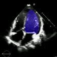
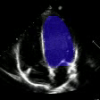
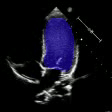

# HBEF 2D


Ejection fraction (EF) estimation from apical four-chamber (A4C) echocardiogram videos is achieved through a pipeline combining deep learning segmentation and detailed analysis of ventricular geometry. A ResNet50-encoded 2D U-Net performs frame-by-frame left ventricle (LV ) segmentation, with ventricular volumes subsequently calculated via the area-length method. To correct systematic biases arising from segmentation errors and heuristic volume estimation, the pipeline incorporates a regression model that predicts the signed error between ground truth and estimated EFs using a set of domain-informed features. The most informative predictors include the ventricular length ratio, volume ratio, and the variability in segmentation consistency over time, quantified as the standard deviation of the Dice similarity coefficient between consecutive frames. This approach achieves a mean absolute error (MAE) of 4.69% on the EchoNet-Pediatric dataset for A4C views, offering an interpretable and refined estimation of cardiac function.[Download paper here](docs/Heuristic_Boosted_Ejection_Fraction_Estimation_from_2D_U_Net_Segmentation.pdf)

<div align="center"> <table> <tr> <td></td> <td></td> <td></td> </tr> </table> </div>


## Installation

### Install `uv`

#### macOS
```bash
brew install uv
```

#### Windows
```bash
powershell -ExecutionPolicy ByPass -c "irm https://astral.sh/uv/install.ps1 | iex"
```

#### Linux
```bash
curl -LsSf https://astral.sh/uv/install.sh | sh
```

## Sync Environment

After installing `uv`, sync the project environment:

```bash
uv sync
```

This command installs all dependencies and creates a virtual environment as specified in your project configuration.

## Usage

Once synced, activate the environment

```bash
source .venv/bin/activate  # macOS/Linux
# or
.venv\Scripts\activate  # Windows
````

Then download the model artifacts:

```bash
uv run download_artifacts.py
```

Place `.avi` echocardiogram video files in the `test` directory before running.


Then run the main scrip:

```bash
uv run main.py
```